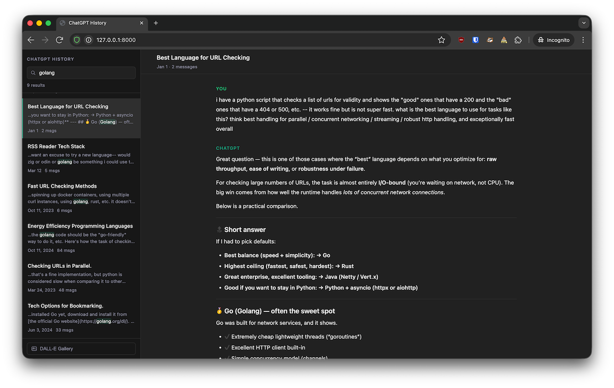
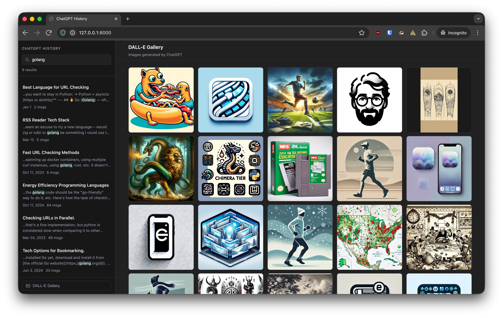

# ChatGPT History Viewer

Browse and full-text search your exported ChatGPT conversation history in a local web app.


## Changes in this fork

This fork includes several small improvements to make the viewer easier to use with large ChatGPT export archives.

The message layout has been adjusted to look more like the ChatGPT interface. Conversations are now displayed in a bubble-style layout where user messages appear on the right and assistant messages appear on the left. This makes long threads easier to read compared to the original stacked layout.

The conversation list loading was also adjusted so the UI can load more items at once (around 200 conversations per request). This improves navigation when browsing large histories with many conversations.

Some fixes were made to media handling so exported images referenced in the conversations can be displayed correctly. The server now scans the export directory recursively to locate media files.

In addition, `build_db.py` was updated to support importing conversations from multiple export folders and split files such as `conversations-000.json` and `conversations-001.json`. This allows large archives or exports from multiple accounts to be merged into a single `history.db` database.

### Example directory structure

A typical setup may look like this:
```
chatgpt-history-viewer/
├── build_db.py
├── server.py
├── history.db
├── exports/
│   ├── account_1/
│   │   ├── conversations.json
│   │   ├── file_00000001.png
│   │   └── file_00000002.pdf
│   ├── account_2/
│   │   ├── conversations-000.json
│   │   ├── conversations-001.json
│   │   └── file_00000003.png
├── static/
│   ├── index.html
│   ├── style.css
│   └── app.js
```
The `build_db.py` script scans the `exports/` directory recursively and imports all conversation files it finds. The server also indexes media files from the same directory so images referenced in the conversations can be served correctly.


**No third-party packages required** — Python 3.9+ and SQLite only.





---

## Setup

1. **Export your ChatGPT data**
   - Go to ChatGPT → Settings → Data Controls → Export
   - Unzip the archive and place `conversations.json` inside a `source/` directory:

   ```
   chatgpt-history/
   ├── source/
   │   └── conversations.json   ← your export
   ├── app.py
   └── ...
   ```

2. **Run**

   ```bash
   python3 app.py
   ```

   On first run the script builds a local SQLite search index (`history.db`).
   This takes roughly 20–40 seconds for a large export (~1,700 conversations).
   Subsequent starts are instant.

3. Open **http://127.0.0.1:8000** (opened automatically).

---

## Features

- **Full-text search** — Porter-stemmed FTS5 index across all message content
- **Conversation list** — sorted by most-recently updated, paginated with Load more
- **Conversation view** — messages rendered as markdown (headers, code blocks, lists, links, tables)
- **Keyboard navigation** — `/` focus search · `↑`/`↓` move through list · `Esc` clear search
- **Fully offline** — no CDN, no internet required after setup

---

## Rebuilding the index

If you import new history or want to start fresh:

```bash
rm history.db && python3 app.py
```

Or run the indexer directly with custom paths:

```bash
python3 build_db.py --source path/to/conversations.json --db history.db
```

---

## File overview

| File | Purpose |
|------|---------|
| `app.py` | Entry point — builds index if needed, starts server, opens browser |
| `build_db.py` | Parses `conversations.json` → SQLite + FTS5 index |
| `server.py` | stdlib HTTP server with a small JSON API |
| `static/index.html` | App shell |
| `static/style.css` | Dark theme styles |
| `static/app.js` | Frontend logic + self-contained markdown renderer |

---

## API

The server exposes two endpoints consumed by the frontend:

```
GET /api/conversations?q=<query>&limit=50&offset=0
GET /api/conversation/<id>
```

---

## Adapting to other exports

The parser in `build_db.py` expects the standard ChatGPT export format — a JSON
array of conversation objects each containing `id`, `title`, `create_time`,
`update_time`, `current_node`, and a `mapping` dict of message nodes.

To support a different format, modify `parse_conversation()` and `message_text()`
in `build_db.py`. The server and frontend are format-agnostic.
